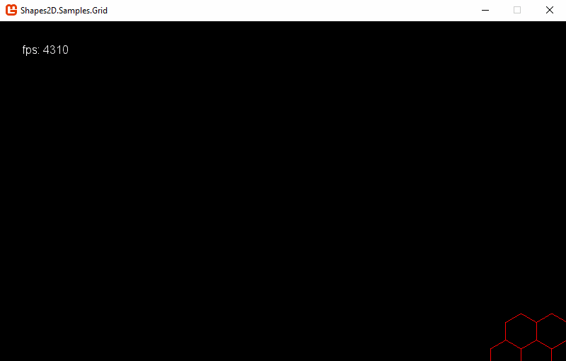
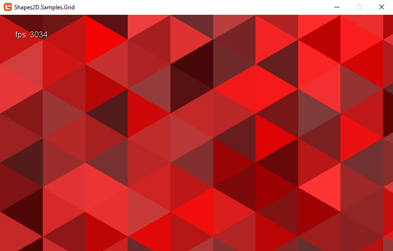
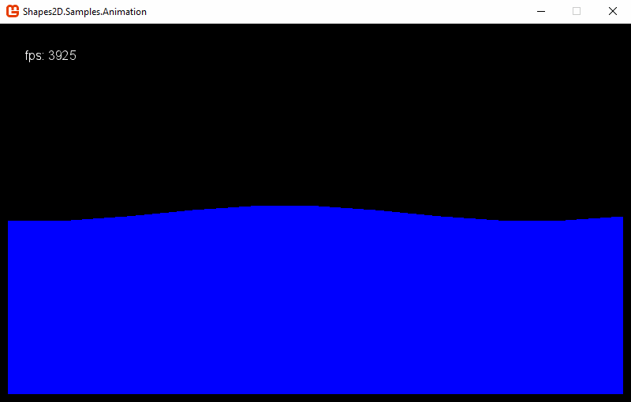
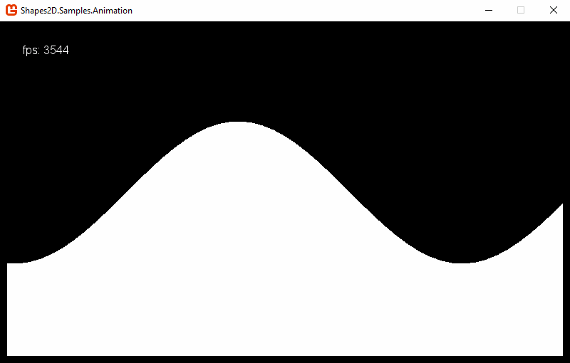

# Shapes2D

Draw 2D geometry in MonoGame/XNA, including primitives such as lines and polygons.

## Samples

These samples are included in the source.

### [Grid](src/Shapes2D.Samples.Grid)

An example of how to draw simple shapes in a grid. You can easily change the scale, grid type (triangle, square, hexagon) and color in the sample code.

### [Animation](src/Shapes2D.Samples.Animation)

An example of how to animate the shapes you draw.

## Dependencies

- [LibTessDotNet](https://github.com/speps/LibTessDotNet) - Polygon tesselation (and triangulation).
